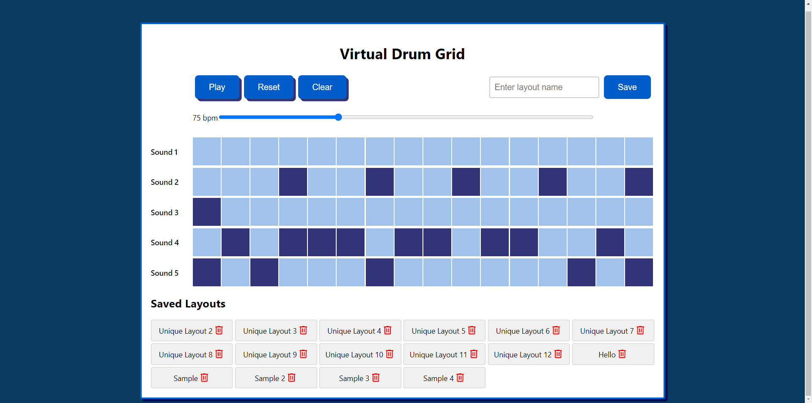

# Virtual Drum Grid

## Description

This project is a Vue.js web application designed to showcase various musical instruments. It features a dynamic interface for users to explore different types of instruments, leveraging Vue 3 for the frontend and `json-server` for a mock backend.

## Preview


## Technologies Used

- **Vue.js 3**: For building the interactive user interface. [Vue.js Documentation](https://v3.vuejs.org/)
- **JSON Server**: To simulate a backend API using a JSON file. [JSON Server Documentation](https://github.com/typicode/json-server)

## Project Setup

1. Clone the repository.
2. Install dependencies:
   ```
   npm install
   ```
3. Start the mock backend server:
   ```
   npx json-server --watch -p 3000 db.json
   ```
4. Run the Vue.js development server:
   ```
   npm run serve
   ```


## Project Structure

- `App.vue`: The main application component.
- `main.js`: Entry point of the Vue application.
- `db.json`: Mock database for the backend.
- `src/components/`: Directory for Vue components.

## Building for Production

To create a production build:
```
npm run build
```
Deploy the `dist/` directory to your hosting service.

## Preview

